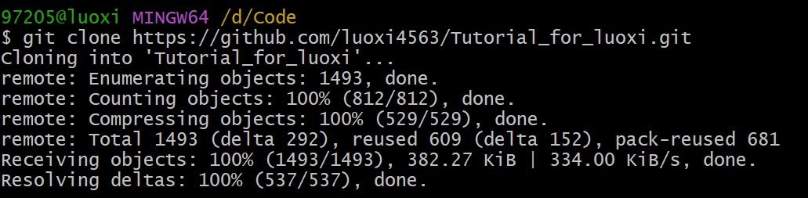
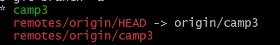
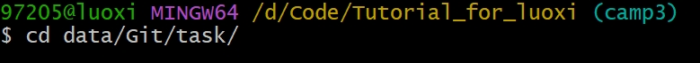
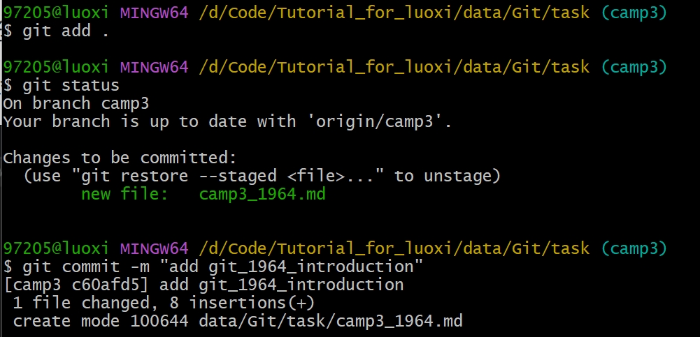
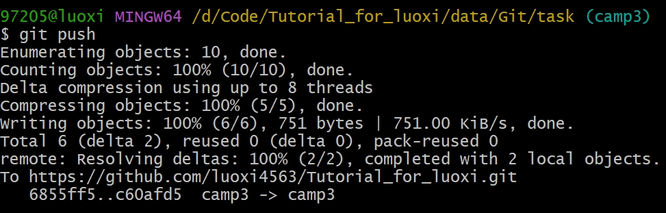
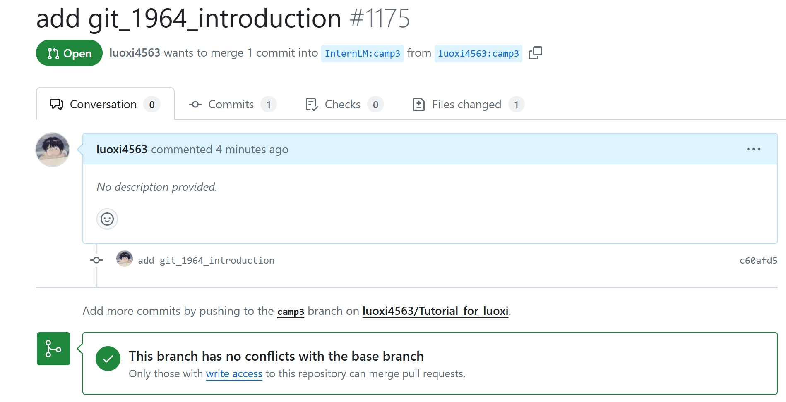

# Git Task

## 任务一：向https://github.com/InternLM/Tutorial 的 camp3 分支提交一份自我介绍

step1：fork：https://github.com/InternLM/Tutorial到自己的仓库，fork后的链接为：https://github.com/luoxi4563/Tutorial_for_luoxi.git

step2：将fork后的仓库克隆到本地，添加自我介绍文件，push到自己的远程仓库

```shell
git clone https://github.com/luoxi4563/Tutorial_for_luoxi.git # 修改为自己frok的仓库
cd Tutorial_for_luoxi/
```



```
git branch -a
```



```shell
git checkout -b camp3 origin/camp3 # 在本地创建一个与远程分支origin/camp3相同的camp3新分支
```

进入./data/Git/task/目录新建camp3_1964.md







step3：PR到官方代码仓库，pull链接https://github.com/InternLM/Tutorial/pull/1175




## 任务二：创建一个个人仓库，用于提交笔记

我的学习笔记仓库链接：https://github.com/luoxi4563/InternStudio3_notebooks.git
