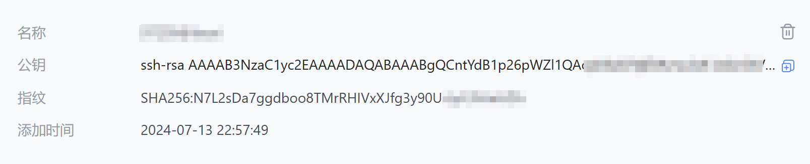
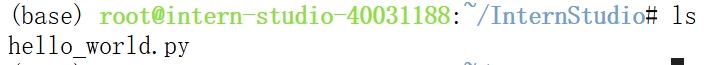
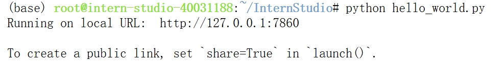
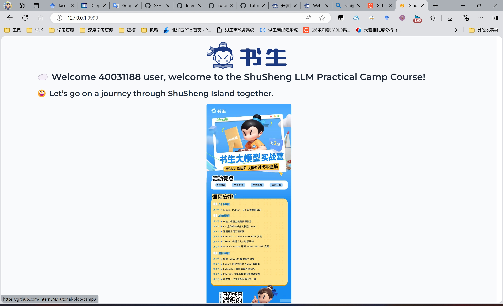

# Linux基础

### 1.配置ssh密钥进行远程连接

1.在本地生成一个ssh密钥，生成的密钥存放目录为C:\Users\useer_name\\\.ssh\id_rsa.pub

```
ssh-keygen -t rsa
```

2.在开发机配置本地的ssh密钥实现ssh远程连接



### 端口映射

将开发机的端口映射到7860端口映射到本地的7860端口

```
ssh -p 37367 root@ssh.intern-ai.org.cn -CNg -L 7860{本地端口}:127.0.0.1:7860{开发机的端口} -o StrictHostKeyChecking=no
```

### 运行`hello_world.py`

1.创建hello_world.py文件



```python
import socket
import re
import gradio as gr
 
# 获取主机名
def get_hostname():
    hostname = socket.gethostname()
    match = re.search(r'-(\d+)$', hostname)
    name = match.group(1)
    
    return name
 
# 创建 Gradio 界面
with gr.Blocks(gr.themes.Soft()) as demo:
    html_code = f"""
            <p align="center">
            <a href="https://intern-ai.org.cn/home">
                
            </a>
            </p>
            <h1 style="text-align: center;">☁️ Welcome {get_hostname()} user, welcome to the ShuSheng LLM Practical Camp Course!</h1>
            <h2 style="text-align: center;">😀 Let’s go on a journey through ShuSheng Island together.</h2>
            <p align="center">
                <a href="https://github.com/InternLM/Tutorial/blob/camp3">
                    
                </a>
            </p>

            """
    gr.Markdown(html_code)

demo.launch()
```



2.实现端口映射，将开发机器的7860端口映射到本地的9999端口

```
ssh -p 33015 root@ssh.intern-ai.org.cn -CNg -L 9999:127.0.0.1:7860 -o StrictHostKeyChecking=no
```

3.在本地打开9999端口，实现对资源的访问



## 2.Linux基础命令

cat、touch、vim、mv、cp、ln、rm、find、ls、nvidia-smi、mkdir、rmdir

## 3.Conda基础

1.添加镜像源

```
#设置清华镜像
conda config --add channels https://mirrors.tuna.tsinghua.edu.cn/anaconda/pkgs/main
conda config --add channels https://mirrors.tuna.tsinghua.edu.cn/anaconda/pkgs/free
conda config --add channels https://mirrors.tuna.tsinghua.edu.cn/anaconda/pkgs/r
conda config --add channels https://mirrors.tuna.tsinghua.edu.cn/anaconda/pkgs/pro
conda config --add channels https://mirrors.tuna.tsinghua.edu.cn/anaconda/pkgs/msys2
```

2.导出和还原环境

```
#获得环境中的所有配置
conda env export --name myenv > myenv.yml
#重新还原环境
conda env create -f  myenv.yml
```

