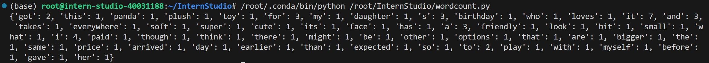
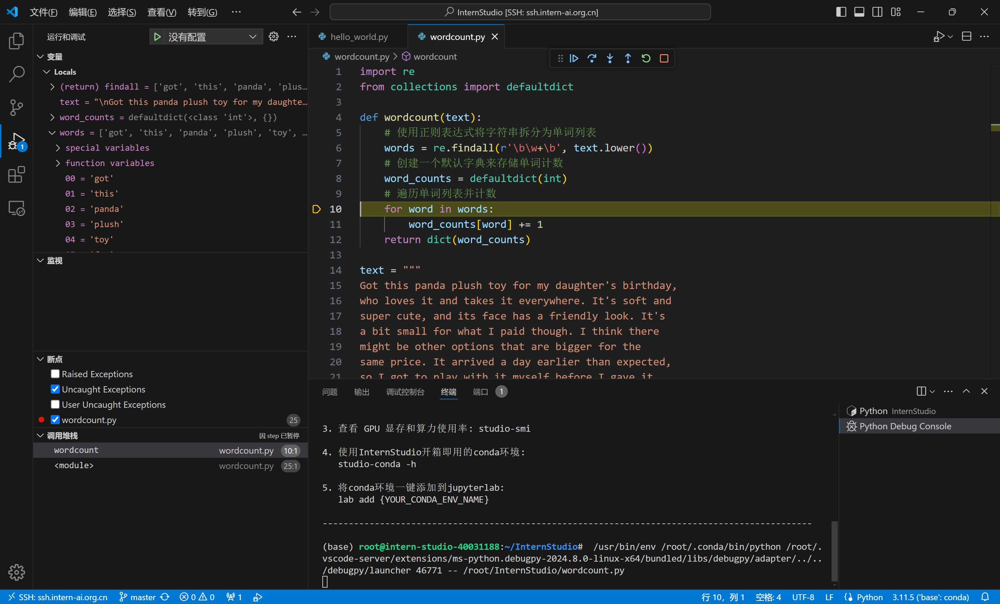

# Python task

## wordcount函数

wordcount函数的实现

```python
import re
from collections import defaultdict

def wordcount(text):
    # 使用正则表达式将字符串拆分为单词列表
    words = re.findall(r'\b\w+\b', text.lower())
    # 创建一个默认字典来存储单词计数
    word_counts = defaultdict(int)
    # 遍历单词列表并计数
    for word in words:
        word_counts[word] += 1
    return dict(word_counts)
```

输入数据

```python
text = """
Got this panda plush toy for my daughter's birthday, who loves it and takes it everywhere. It's soft and
super cute, and its face has a friendly look. It's a bit small for what I paid though. I think there might be other options that are bigger for the same price. It arrived a day earlier than expected, so I got to play with it myself before I gave it to her.
"""
```

输出结果

```python
{'got': 2, 'this': 1, 'panda': 1, 'plush': 1, 'toy': 1, 'for': 3, 'my': 1, 'daughter': 1, 's': 3, 'birthday': 1, 'who': 1, 'loves': 1, 'it': 7, 'and': 3, 'takes': 1, 'everywhere': 1, 'soft': 1, 'super': 1, 'cute': 1, 'its': 1, 'face': 1, 'has': 1, 'a': 3, 'friendly': 1, 'look': 1, 'bit': 1, 'small': 1, 'what': 1, 'i': 4, 'paid': 1, 'though': 1, 'think': 1, 'there': 1, 'might': 1, 'be': 1, 'other': 1, 'options': 1, 'that': 1, 'are': 1, 'bigger': 1, 'the': 1, 'same': 1, 'price': 1, 'arrived': 1, 'day': 1, 'earlier': 1, 'than': 1, 'expected': 1, 'so': 1, 'to': 2, 'play': 1, 'with': 1, 'myself': 1, 'before': 1, 'gave': 1, 'her': 1}
```

代码运行结果



## VsCode debug运行wordcount过程



