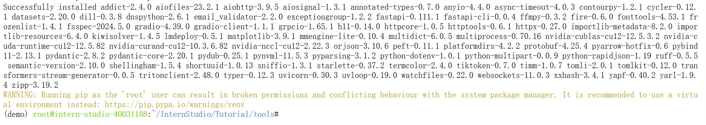

# Demo Task

## InternLM2-Chat-1.8B 模型的部署

1.环境配置，使用anaconda创建一个demo环境，并激活环境，安装依赖

```python
# 创建环境
conda create -n demo python=3.10 -y
# 激活环境
conda activate demo
```

环境激活截图：


```python
# 安装 torch
conda install pytorch==2.1.2 torchvision==0.16.2 torchaudio==2.1.2 pytorch-cuda=12.1 -c pytorch -c nvidia -y
# 安装其他依赖
pip install transformers==4.38 sentencepiece==0.1.99 einops==0.8.0 protobuf==5.27.2 accelerate==0.33.0 streamlit==1.37.0
```

依赖安装完成截图：


2.demo部署：创建cli_demo.py文件，利用transformers库使用InternLM2-Chat-1.8B模型

```python
import torch
from transformers import AutoTokenizer, AutoModelForCausalLM


model_name_or_path = "/root/share/new_models/Shanghai_AI_Laboratory/internlm2-chat-1_8b"

tokenizer = AutoTokenizer.from_pretrained(model_name_or_path, trust_remote_code=True, device_map='cuda:0')
model = AutoModelForCausalLM.from_pretrained(model_name_or_path, trust_remote_code=True, torch_dtype=torch.bfloat16, device_map='cuda:0')
model = model.eval()

system_prompt = """You are an AI assistant whose name is InternLM (书生·浦语).
- InternLM (书生·浦语) is a conversational language model that is developed by Shanghai AI Laboratory (上海人工智能实验室). It is designed to be helpful, honest, and harmless.
- InternLM (书生·浦语) can understand and communicate fluently in the language chosen by the user such as English and 中文.
"""

messages = [(system_prompt, '')]

print("=============Welcome to InternLM chatbot, type 'exit' to exit.=============")

while True:
    input_text = input("\nUser  >>> ")
    input_text = input_text.replace(' ', '')
    if input_text == "exit":
        break

    length = 0
    for response, _ in model.stream_chat(tokenizer, input_text, messages):
        if response is not None:
            print(response[length:], flush=True, end="")
            length = len(response)
```

3.运行cli_demo.py，通过对话生成一个小故事


### 使用streamlit通过端口映射在本地使用InternLM2-Chat-1.8B

1.使用git clone克隆远程仓库

```shell
git clone https://github.com/InternLM/Tutorial.git
```

2.进入代码库，使用streamlit run命令运行InternLM2-Chat-1.8B

```shell
cd Tutorial/tools
streamlit run streamlit_demo.py --server.address 127.0.0.1 --server.port 6006
```


3.通过端口映射实现在web端使用InternLM2-Chat-1.8B

```shell
ssh -CNg -L 6006:127.0.0.1:6006 root@ssh.intern-ai.org.cn -p 39111
```


## InternLM-XComposer2-VL-1.8B 模型的部署

1.安装LMdeploy及其他依赖

```python
pip install lmdeploy[all]==0.5.1 timm==1.0.7
```



2.使用 LMDeploy 启动一个与 InternLM-XComposer2-VL-1.8B 模型交互的 Gradio 服务

```shell
lmdeploy serve gradio /share/new_models/Shanghai_AI_Laboratory/internlm-xcomposer2-vl-1_8b --cache-max-entry-count 0.1
```

运行结果：


## InternVL2-2B 模型的部署

1.使用LMdeploy直接启动gradio运行InternVL2-2B

```shell
lmdeploy serve gradio /share/new_models/OpenGVLab/InternVL2-2B --cache-max-entry-count 0.1
```


